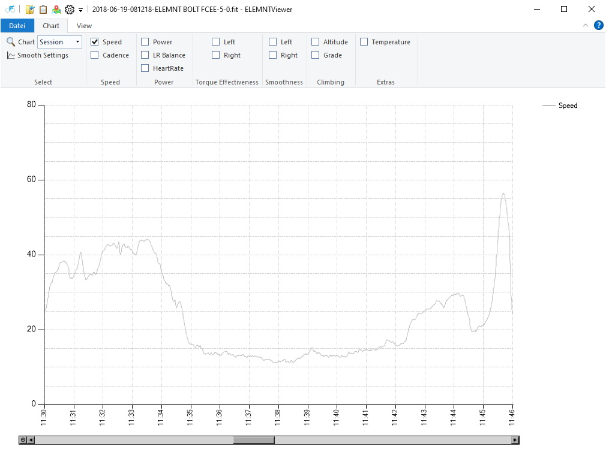

# ELEMNTViewer

## Description

**Welcome Road bike rider and other cyclist with a Wahoo ELEMNT (or Bolt, Roam) Bike Computer**

You can analyze your workout and you can see detailed information about your workout with this App on a Windows Computer (Windows 7 and newer versions).

This App can read the *.fit files of the Bike-Computer Wahoo ELEMNT, ELEMNT Bolt and ELEMNT Roam. In the *.fit file are all informations about your workout. It shows the contents in a graphical chart view. The Session-, Laps-values and some other values are shown in tabular manner. In an OpenStreetMap window you can see the route of your workout. See an example fit file in the Example folder.

The easiest way to get the *.fit files to the Windows Computer is: Set up a free DropBox account and connect it to the Wahoo App on your Phone. Now the *.fit files are transfered to the DropBox after every workout. on the Windows Computer you have to install the DropBox with your account. Now you can see the *.fit files on the DropBox folder Apps\WahooFitness. These files you have to select by the App ELEMNTViewer.

*.gpx files with routes (tracks) and waypoints can also be displayed on a map in the ElemntViewer from version 2.3.0.

ELEMNTViewer is Open Source Software, released by MIT License.

ELEMNTViewer uses the Fit Dll from "ThisIsAnt FitSDK" for decoding of *.fit files

Minimum Display resolution is 1024 x 768.

ELEMNTViewer is developed using Visual Studio Community and uses .NET-framework 4.6.2

## Contributions

 ELEMNTViewer makes use of the following third party components:

| Name                                                         | Author(s)                                                    | License     |
| ------------------------------------------------------------ | ------------------------------------------------------------ | ----------- |
| [FitSDK](https://www.thisisant.com/developer/resources/downloads/)                   | [ThisIsAnt](https://www.thisisant.com/)                      | MIT License |
| [Windows Ribbon](https://github.com/harborsiem/WindowsRibbon) | [harborsiem](https://github.com/harborsiem) & others | MIT License |
| [XAML Map Control](https://github.com/ClemensFischer/XAML-Map-Control) | [ClemensFischer](https://github.com/ClemensFischer) | MS-PL License |

## Topics of the ELEMNTViewer App
- Session View 
- Lap Views 
- Heart Rate Zones 
- Power Zones 
- graphical view from the workout values with zoom function. You can choose to show the whole session or a single lap. Some values (Power, other Power specific values, ...) can be smoothed from 3 sec to 30 sec.
- Show the route of the workout in a map, store the route to a gpx - file.

## Installation
Requirement for installation is the Microsoft .NET Framework 4.6.2 or any higher version. If it is not installed on your computer then you can download it from a Microsoft page. Install this first.

You also need Microsoft .NET Framework 3.5. In Windows 10 you have to go to the Control Panel > Programs > Programs and Features. On the left side click to "Turn Windows features on or off". You get a new dialog. Here you have to select ".NET Framework 3.5 (includes ...)".

[Microsoft .NET Framework](http://www.microsoft.com/netframework)

Unzip the setup from the Releases page. You get a ELEMNTSetup.exe (in former versions: ELEMNTViewer.msi) file. With a double click to this file you install the program.
Via Startmenu you can select and call ELEMNTViewer.

## Latest Setup
#### (zipped Setup)

see [Releases page](https://github.com/harborsiem/ELEMNTViewer/releases) on this Site

## Pictures of ELEMNTViewer App

